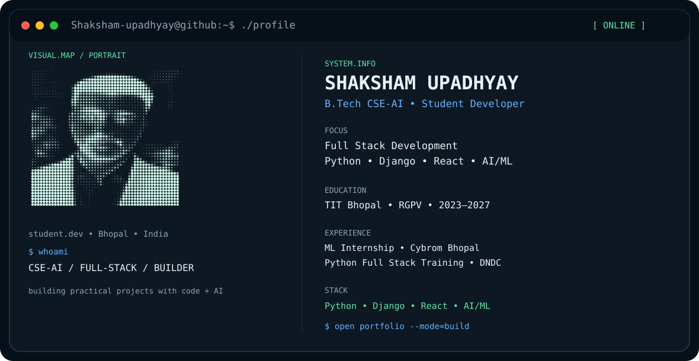

# 👋 Shaksham Upadhyay

  <picture>
    <source media="(prefers-color-scheme: dark)" srcset="./dark.svg">
    <source media="(prefers-color-scheme: light)" srcset="./light.svg">
    
  </picture>

## 👨‍💻 About Me

B.Tech CSE-AI student at **TIT Bhopal, RGPV (2023–2027)**, interested in full-stack development and AI/ML. I enjoy building practical applications and continuously improving my software development and problem-solving skills.

## 🛠️ Tech Stack

`C` `C++` `Python` `Django` `Django REST Framework` `React.js` `JavaScript` `HTML` `CSS` `AI/ML` `Git` `GitHub`

## 🚀 Projects

| Project | Technologies |
|---|---|
| **Todo List** | Django, HTML, CSS |
| **Car Booking Site** | Django, HTML, CSS |
| **Coding Competition Platform** | Django REST Framework, React.js |

## 🏆 Certifications & Training

- AI/ML — Cybrom Bhopal
- Full Stack Development — DNDC Bhopal
- AI/ML — Ramrajya Technology
- Full Stack Development — Coursera

## 📚 Currently Learning

- React.js
- REST APIs / Django REST Framework

## 🎯 Career Direction

Aspiring Full Stack Developer with a strong interest in AI/ML, focused on building practical, scalable applications and continuously improving software engineering skills.

## 🔗 Connect

- **GitHub:** [Shaksham-upadhyay](https://github.com/Shaksham-upadhyay)
- **LinkedIn:** [Shaksham Upadhyay](https://www.linkedin.com/in/shaksham-upadhyay-1bb607303)
- **Email:** [sakshamupadhyay83@gmail.com](mailto:sakshamupadhyay83@gmail.com)
